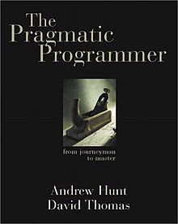

!SLIDE centered

&nbsp; 

# Introducción a Ruby on Rails#
## 2 - Despegando ##
Mayo 2013
 Fernando Martínez
 

&nbsp; 

!SLIDE bullets incremental
# Parte 2 #
## Despegando ##
* Instalar
* Comenzar una aplicación
* Colaborar
* Desplegar

!SLIDE subsection
# Instalación #

!SLIDE bullets incremental
##¿Que es esto de las _gemas_?##
* Librerías empaquedatas (eggs, pear, cpan...)
* Script de instalación **gem**
* Servidores públicos <https://rubygems.org/>
* y más <http://gems.github.com/list.html>

!SLIDE commandline incremental
##¿y cómo...?##
    $ gem
    RubyGems is a sophisticated package manager for Ruby.
    This is a basic help message containing pointers to more information.

      Usage:
        gem -h/--help
        gem -v/--version
        gem command [arguments...] [options...]

      Examples:
        gem install rake
        gem list --local
        gem build package.gemspec
        gem help install

      Further help:
        gem

!SLIDE bullets incremental
## Ejercicio ##
* List local gems
* Search 'rainbow' gem
* Search remotely
* Install
<pre style="text-align:left">
    $ ruby -rubygems -e 'require "rainbow";
    puts "red".foreground(:red)'
    red
</pre>

.notes desinstalar y probar a bajar una version en concreto

!SLIDE bullets incremental
## pero...##
* Many projects, many gems
* Dependencies
* Conflict
* **RVM Gemsets**
* **Bundler & Gemfile**

!SLIDE bullets incremental
# Ejercicio Gemsets#
* Abrir la documentacion de RVM
* Crear dos gemsets _foo_ & _bar_
* Cambiar manualmente en tre uno y otro
* Crear fichero '_.rvmrc_
* Cambiar automáticamente de gemset

!SLIDE
# Ejercicio de bundler #
bueno, esperad...

!SLIDE subsection
# Comienzo #

!SLIDE commandline incremental
    $ gem install rails -v 3.2.13
    ...
    $ rails -v
    Rails 3.2.13
    $ rails new prueba
    ...
    .
    .
    Your bundle is complete! Use `bundle show [gemname]` to see where a bundled
    gem is installed.

!SLIDE smbullets incremental
## ¿que tenemos? (carpetas)
* app
* config
* db
* lib
* log
* public
* script
* test
* tmp
* vendor

!SLIDE smbullets incremental
## ¿que tenemos? (gemas)
* sqlite3
* sass-rails
* cofee-rails
* uglifier
* jquery-rails

!SLIDE bullets incremental
##Hay otras formas:##
* <http://railsapps.github.io/rails-composer/>
* Conocimiento de 1era mano *vs* experiencia colectiva
* Aprender cómo *vs* desarrollar _rápido_
* Ajuste fino *vs* plantilla (Bootstrap)

!SLIDE subsection
# Colaboración (tech) #

!SLIDE bullets incremental
* escribir código (bugs)
* guardar una versión
* cambiar,añadir código
* guardar una versión
* ...
* Descubrir bug
* Buscar cuándo se agregó...

!SLIDE bullets incremental
## SCM ##
* El control de versiones (SCM) es un sistema que registra los cambios en un fichero o conjunto de ficheros
a lo largo del tiempo de modo que cada version específica pueda ser recuperada posteriormente.
* 

!SLIDE smbullets incremental
# Trabajando con Git #
* edito un fichero y lo salvo
* reviso la lista de ficheros tocados _stat_
* reviso los cambios _diff_
* agrego el fichero a una 'reserva' _add_
* confirmo un cambio con un 'mensaje' _commit_
* 'envio' el cambio a un servidor _push_
* <http://ndpsoftware.com/git-cheatsheet.html>

!SLIDE commandline incremental
## git 1 - lo básico ##
    $ git config --global user.name "Your Name"
    $ git config --global user.email "your@mail.com"
    $ mkdir Gittest
    $ cd Gittest
    $ git init
    $ edit README.txt
    $ edit myscript.rb
    $ git status
    $ git add README.txt myscript.rb
    $ git status
    $ git commit -m "Now with files"

!SLIDE commandline incremental
## git 2 - por las ramas ##
    $ git branch
    $ git branch experiment
    $ git checkout experiment
    $ git branch
    $ edit new_file.txt
    $ git add .
    $ git commit -m "experiment exclusive file"
    $ git log
    $ ls
    $ git checkout master
    $ ls
    $ git log

!SLIDE commandline incremental
## git 2 - por las ramas ##
    $ git status
    $ git diff experiment
    $ git merge experiment
    $ git log -p
    $ ls

!SLIDE smbullets
* Ejercicio: conflictos
* 1. haz una rama, edita un fichero, haz commit
* 2. regresa a master, edita el mismo fichreo/linea
* 3. haz commit a master y mezcla la rama
* Hay conflictos? ¿Por qué?
* ¿Puedes resolverlos?
* Configura Git en la aplicación Rails

!SLIDE subsection
# Colaboración (org) #

!SLIDE

<http://goo.gl/IZJIF>

!SLIDE

## <http://goo.gl/7Ih1Z> ##

!SLIDE bullets incremental
# Metodologías #
* [**agile**manifesto.org](http://agilemanifesto.org)
* [**extreme**programming.org](http://extremeprogramming.org)
* [**scrum**.org](http://scrum.org)
* [**lean**: goo.gl/ePctp](http://goo.gl/ePctp)
* ¿Conoceis otros?

!SLIDE smbullets incremental
## Metodologías - Estrategia ##
* Elige una
* Ponte objetivos
* Aguanta!
* Mide
* Evalúa
* Adapta
* Repite

!SLIDE
# Metodologías - Factores #
<table>
<tr><th>Técnicos</th><th>Organizativos</th>
<tr>
<td>
<ul><li>Tests</li><li>Mocks</li><li>Fases</li><li>CI</li><li>CD</li><li>Remoto?</li><li>Pares</li></ul>
</td>
<td>
<ul><li>Tamaño equipo</li><li>Ritmo</li><li>Jerarquía</li><li>Especificidad metas</li>
<li>Specs vs objetivos</li><li>Legal, PI</li></ul>
</td>
</tr>
</table>

!SLIDE
## Ejemplo: Git y Scrum

.notes Explicar Sprint / Story / Backlog / Item / Puntos
¿Qué comandos de git se usan en cada parte?

!SLIDE subsection
# Despliege #

!SLIDE bullets incremental
## del IDE a la Web ##
* HTML+CSS → FTP upload
* <serverlang>+html+css+js → FTP+Restart
* Downtime, Releases & Rollback
* **herramientas** [Capistrano](https://github.com/capistrano/capistrano/wiki), [Sprockets](getsprockets.org) ([artículo](http://goo.gl/stVRZ))
* **PaaS** [EngineYard](http://engineyard.com), [Heroku](http://heroku.com), [Nitrous.IO](https://nitrous.io)...

.notes Recordar la historia del que aprendía Rails
"You just FTP the thing up, don't you?"

!SLIDE smbullets incremental
## Ejercicio ##
* Crear una aplicación
* Ponerla en Git
* Registrarse en heroku <http:://api.heroku.com/signup>
* Bajarse la herramientas de heroku <https://toolbelt.heroku.com/>
* $ heroku login # funciona?
* Poner la 'app' online

!SLIDE commandline incremental
## ayudas: Creando la applicación ##
    $ gem list # rails esta? si no, instala
    $ rails new curso
    ...
    $ cd curso
    $ rvm --rvmrc --create 1.9.3@curso
    $ rvm gemset list
    $ gem list
    $ bundle
    ...

!SLIDE commandline incremental
## ayudas: configurando Git
    $ git status
    $ git add .
    ...
    $ git status # see difference with previous status
    $ git commit -m "Crear app rails"
    $ # git remote add origin <url>
    $ # git push origin master

.notes el remote no es necesario si usamos heroku

!SLIDE commandline incremental
## ayudas:  "desarrollando" en Rails ##
    $ cd curso # si no estas
    $ rails s
    $ open <http://localhost:3000>
    $ echo "Hola mundo" > public/index.html
    $ # reload browser

!SLIDE code incremental
## ayudas: adaptar a heroku ##
    @@@ ruby
    # Gemfile
    group :production do
      gem 'pg', '0.12.2'
    end

    $ bundle install --without production
    # no instala nada pero cambia Gemfile.lock

    $ git push heroku master # empuja el HEAD de master
    $ heroku open
    $ heroku rename fer_curso_rr # cada uno el suyo

.notes Gemfile.lock es lo que usa heroku para darnos gemas

